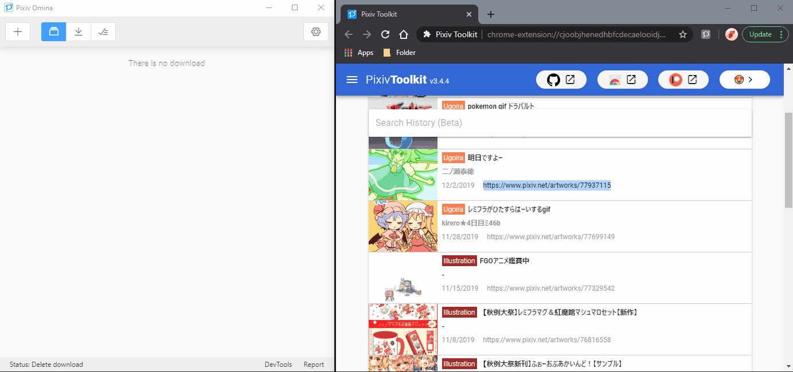
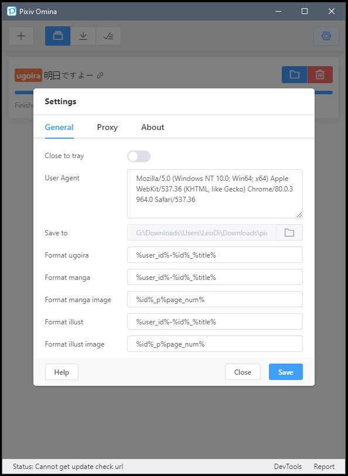

### [**简体中文**](https://github.com/leoding86/pixiv-omina/blob/master/README_zh-CN.md) | English

---

<h1 style="text-align:center">
<br>
Pixiv Omina
</h1>

Pixiv Omina is a software to download works on Pixiv. It's simple and easy to use. It's even better if you are a [Pixiv Toolkit](https://github.com/leoding86/webextension-pixiv-toolkit) user, you can use click-to-download feature.

Pixiv Omina is powered by [Electron](https://electronjs.org/).

# Platforms💻

Test on Window 10(1903). In theory, it can run on Mac and Linux if you can compile it.

# Features✨

* Easy UI
* Generate gif for ugoira work automatically and pack frame information to zip file
* Download user works (input the user profile url to the download dialog)
* **Download bookmarks** - Now supports both methods:
  * **Own bookmarks**: Use the Bookmark tab to download your public/private bookmarks
  * **User bookmarks**: Paste any user's bookmark URL (e.g., `https://www.pixiv.net/en/users/123456/bookmarks/artworks`) to download their public bookmarks
* Auto rename using the rename settings
* Restore downloads after application restart
* Skip downloaded works, so it can download works incrementally
* Click-to-Download (You need install [Pixiv Toolkit](https://github.com/leoding86/webextension-pixiv-toolkit) in your browser)
* Check new version automatically (No auto-update, I think auto-update could be annoying sometimes)
* Close to tray (You need to enable this feature at setting page)
* Support http/socks proxy (If you use socks proxy you need input proxy url with schemel)

# C++ Console Downloader🖥️

A command-line tool for downloading Pixiv artworks from a list of URLs. Perfect for batch downloads from bookmark exports!

## Features

- Download artworks one at a time from a file containing URLs
- Automatic duplicate detection with SQLite database
- Configurable download directory
- Uses the same cookie file as bookmark-url-extractor.js
- Skip already downloaded works (or force re-download with `-forceRepeated`)
- Multi-page artwork support
- Real-time download progress

## Quick Start

```bash
# 1. Extract bookmark URLs using the Node.js script
npx electron bookmark-url-extractor.js "YOUR_BOOKMARK_URL" --output=file

# 2. Download artworks using the C++ console program
pixiv_downloader.exe -d "C:\My Downloads" urls.txt
```

## Downloads

- **Pre-built Windows executable**: Check the [GitHub Actions](https://github.com/RalpizarB/pixiv-omina-singleDownload/actions) page for the latest build
- **Build from source**: See [cpp-downloader/README.md](cpp-downloader/README.md) for instructions

For detailed documentation, see:
- [cpp-downloader/QUICKSTART.md](cpp-downloader/QUICKSTART.md) - Quick reference
- [cpp-downloader/README.md](cpp-downloader/README.md) - Usage guide
- [cpp-downloader/IMPLEMENTATION.md](cpp-downloader/IMPLEMENTATION.md) - Technical details
- [COMPLETE_WORKFLOW.md](COMPLETE_WORKFLOW.md) - Complete workflow from extraction to download

# Downloads⚓

[Go to releases page](https://github.com/leoding86/pixiv-omina/releases)

## Available Packages

- **Windows Installer (NSIS)**: Traditional installer with custom installation directory support
  - 32-bit (ia32) and 64-bit (x64) versions available
- **Windows Portable (ZIP)**: No installation required, just extract and run
  - 32-bit (ia32) and 64-bit (x64) versions available
  - Ideal for users without admin rights or who prefer portable apps

# Q & A ❓

Q: Why I can't use it?

A: If you can't visit Pixiv or you don't have a Pixiv account you can't use this.

Q: Why is the completed task missing when I restart the application?

A: Application will remove completed downloads task after restarted.

Q: How to download more than 2 works at the same time?

A: No, you can't for now, because generate gif is a pretty heavy task. Maybe I'll add a setting to control how many download tasks can be performed at the same time.

# Known Issues🤔

* DO NOT add too many downloads! I have not tested the downloads limitation, too many downloads may crash the application. It's easy to add large number download tasks by downloading user works(input the user profile url to the download dialog), so be really careful to use this feature like download multiple users works at same time (Some of the users have thousands works, It's nuts!).

* The installation will not register the custom protocol on Window 10 sometimes. If you find the Pixiv Toolkit's "Pixiv Omina" button does nothing, you can try `panteras81`'s solution in [comment](https://github.com/leoding86/webextension-pixiv-toolkit/issues/27#issuecomment-605540955) from issue `#27`.

Feel free to open issue if you meet any problem or have any idea😀

# Screenshots📺

Download by input the work url



Click-to-Download


Some settings



# Development🔧

## Install dependencies
```bash
yarn
```

### Development Scripts

```bash
# run application in development mode
yarn dev

# compile source code and create webpack output
yarn compile

# `yarn compile` & create build with electron-builder
yarn dist

# `yarn compile` & create unpacked build with electron-builder
yarn dist:dir
```
