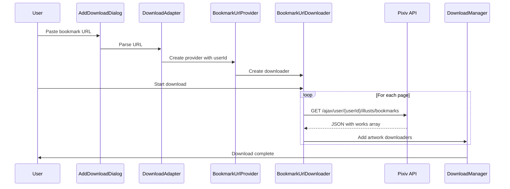

# Bookmark Downloads - Implementation Documentation

## Overview

This document describes the implementation of bookmark download functionality in Pixiv Omina, including both the UI-based bookmark downloader and URL-based bookmark downloader.

## Feature Status: ✅ WORKING

Both methods of downloading bookmarks are now functional:
1. **UI-based**: Download your own bookmarks via the Bookmark tab
2. **URL-based**: Download any user's public bookmarks by pasting their bookmark URL

---

## Architecture Diagram

```mermaid
flowchart TD
    A[User Action] --> B{Input Type?}
    B -->|Bookmark Tab| C[BookmarkProvider]
    B -->|URL Input| D[DownloadAdapter]
    
    D --> E{URL Pattern Match}
    E -->|User Bookmark URL| F[BookmarkUrlProvider]
    E -->|Regular Artwork URL| G[GeneralArtworkProvider]
    E -->|User Profile URL| H[UserProvider]
    
    C --> I[BookmarkDownloader]
    F --> J[BookmarkUrlDownloader]
    
    I --> K[Fetch Own Bookmarks<br/>/ajax/user/self/illusts/bookmarks]
    J --> L[Fetch User's Bookmarks<br/>/ajax/user/{userId}/illusts/bookmarks]
    
    K --> M[Parse JSON Response]
    L --> M
    
    M --> N[Create Artwork Downloaders]
    N --> O[DownloadManager]
    O --> P[Download Artworks]
```

---

## Component Overview

### 1. Bookmark Tab (UI-based Downloads)

**Flow:**
```
AddDownloadDialog (Vue) 
  → createBmDownloadAction (DownloadService)
    → BookmarkProvider.createProvider()
      → BookmarkDownloader.createDownloader()
        → Request: /ajax/user/self/illusts/bookmarks
          → Parse JSON
            → Create GeneralArtworkDownloader for each work
```

**Files Involved:**
- `src/renderer/components/dialogs/AddDownloadDialog.vue` - UI component with Bookmark tab
- `src/main/services/DownloadService.js` - Handles `createBmDownload` IPC action
- `src/main/modules/Downloader/Providers/Pixiv/BookmarkProvider.js` - Provider for self bookmarks
- `src/main/modules/Downloader/WorkDownloader/Pixiv/BookmarkDownloader.js` - Downloads own bookmarks

**API Endpoint:**
```
GET https://www.pixiv.net/ajax/user/self/illusts/bookmarks
    ?tag=
    &offset={page * 48}
    &limit=48
    &rest={show|hide}
    &lang=en
```

---

### 2. URL-based Downloads (NEW)

**Flow:**
```
User Pastes URL: https://www.pixiv.net/en/users/18556068/bookmarks/artworks
  → UrlMatcher.isPixivBookmark() validates URL
    → DownloadAdapter matches pattern
      → BookmarkUrlProvider.createProvider(userId: 18556068)
        → BookmarkUrlDownloader.createDownloader()
          → Request: /ajax/user/18556068/illusts/bookmarks
            → Parse JSON
              → Create GeneralArtworkDownloader for each work
```

**Files Involved:**
- `src/utils/UrlMatcher.js` - Validates bookmark URLs with `isPixivBookmark()`
- `src/main/modules/Downloader/DownloadAdapter.js` - Pattern matching for bookmark URLs
- `src/main/modules/Downloader/Providers/Pixiv/BookmarkUrlProvider.js` - **NEW** Provider for user bookmark URLs
- `src/main/modules/Downloader/WorkDownloader/Pixiv/BookmarkUrlDownloader.js` - **NEW** Downloads user's public bookmarks

**URL Pattern:**
```regex
/^https?:\/\/www\.pixiv\.net\/(?:[a-z]+\/)?users\/(?<userId>\d+)\/bookmarks\/artworks(?:\?.*)?$/i
```

**Supported URL formats:**
- `https://www.pixiv.net/en/users/18556068/bookmarks/artworks`
- `https://www.pixiv.net/users/18556068/bookmarks/artworks`
- `https://www.pixiv.net/ja/users/18556068/bookmarks/artworks`

**API Endpoint:**
```
GET https://www.pixiv.net/ajax/user/{userId}/illusts/bookmarks
    ?tag=
    &offset={page * 48}
    &limit=48
    &rest=show
    &lang=en
```

---

## Data Flow Diagram



---

## Code Structure

### New Files Created

1. **BookmarkUrlProvider.js**
   - Purpose: Handle bookmark URLs with user IDs
   - Location: `src/main/modules/Downloader/Providers/Pixiv/`
   - Key methods:
     - `createProvider({ url, context })` - Creates provider instance
     - `createDownloader({ saveTo, options })` - Creates downloader instance

2. **BookmarkUrlDownloader.js**
   - Purpose: Download bookmarks from a specific user
   - Location: `src/main/modules/Downloader/WorkDownloader/Pixiv/`
   - Key methods:
     - `getBookmarkUrl(userId, page)` - Builds API URL
     - `requestBookmarkPage(page)` - Fetches bookmark data
     - `getItems(content)` - Parses JSON response
     - `addArtworkDownloaders(content)` - Creates artwork downloaders
     - `processAllPages()` - Iterates through all pages
     - `start()` - Entry point

### Modified Files

1. **DownloadAdapter.js**
   - Added bookmark URL pattern to `matchMaps`
   - Pattern placed before user pattern to avoid conflicts

2. **UrlMatcher.js**
   - Added `isPixivBookmark()` method
   - Added to `matcherList` array

3. **Providers/index.js**
   - Exported `PixivBookmarkUrlProvider`

---

## Pattern Matching Order

**IMPORTANT:** The order in `DownloadAdapter.matchMaps` matters!

```javascript
matchMaps = [
  UserProvider,          // /users/123
  BookmarkUrlProvider,   // /users/123/bookmarks/artworks  ⬅️ Must be before UserProvider
  GeneralArtworkProvider,// /artworks/123
  // ... other providers
]
```

If UserProvider was first, it would match `/users/123/bookmarks/artworks` and treat it as a user profile, not bookmarks.

---

## API Comparison

| Feature | Own Bookmarks | User's Bookmarks |
|---------|---------------|------------------|
| Endpoint | `/ajax/user/self/illusts/bookmarks` | `/ajax/user/{userId}/illusts/bookmarks` |
| Authentication | Required | Required (for API access) |
| Privacy | Public + Private | Public only |
| User ID | Not needed | Required in URL |
| Use Case | Download your bookmarks | Download someone else's public bookmarks |

---

## Usage Examples

### Method 1: Bookmark Tab (Own Bookmarks)

1. Click "+" button to open Add Download dialog
2. Switch to "Bookmark" tab
3. Select bookmark type:
   - **Public** - Your public bookmarks
   - **Private** - Your private bookmarks
4. Select mode:
   - **All** - Download all pages
   - **Pages** - Specify page ranges (e.g., "1-3,5-10")
5. Choose save location
6. Click "Add"

### Method 2: URL Input (Any User's Public Bookmarks)

1. Go to a user's bookmark page on Pixiv:
   - Example: `https://www.pixiv.net/en/users/18556068/bookmarks/artworks`
2. Copy the URL
3. Click "+" button to open Add Download dialog
4. Stay on "URL" tab
5. Paste the bookmark URL
6. Choose save location
7. Click "Add"

---

## Pagination Handling

Both implementations use the same pagination strategy:

- **Page Size:** 48 artworks per page
- **Offset Calculation:** `offset = (page - 1) × 48`
- **Continuation:** Keep fetching until `works.length < 48`

Example:
- Page 1: offset=0, limit=48
- Page 2: offset=48, limit=48
- Page 3: offset=96, limit=48

---

## Error Handling

### Common Errors

1. **Authentication Required**
   - User must be logged into Pixiv
   - Shows error message: "You need login first"

2. **User Not Found**
   - Invalid user ID in URL
   - API returns error response

3. **No Bookmarks**
   - User has no public bookmarks
   - No downloaders created (not an error)

4. **Rate Limiting**
   - Too many requests to Pixiv API
   - Request fails with error

---

## Testing

### Test Case 1: Own Bookmarks via Bookmark Tab
```
Steps:
1. Login to Pixiv
2. Open Bookmark tab
3. Select "Public" bookmarks
4. Set mode to "All"
5. Click Add

Expected: All public bookmarks are queued for download
```

### Test Case 2: User Bookmarks via URL
```
Steps:
1. Login to Pixiv
2. Copy URL: https://www.pixiv.net/en/users/18556068/bookmarks/artworks
3. Paste in URL input
4. Click Add

Expected: User 18556068's public bookmarks are queued for download
```

### Test Case 3: Invalid Bookmark URL
```
Steps:
1. Paste invalid URL: https://www.pixiv.net/en/users/invalid/bookmarks/artworks
2. Click Add

Expected: Error message or no matching provider found
```

---

## Troubleshooting

### Issue: Bookmark URL doesn't work
**Solution:** Ensure the URL follows the correct format:
- ✅ `https://www.pixiv.net/en/users/123456/bookmarks/artworks`
- ❌ `https://www.pixiv.net/bookmark.php?id=123456` (old format)

### Issue: No bookmarks downloaded
**Possible causes:**
1. User has no public bookmarks
2. Not logged into Pixiv
3. Network error or rate limiting
4. User ID doesn't exist

### Issue: Only downloads first page
**Possible causes:**
1. Check logs for errors
2. Pixiv API might be rate-limiting
3. Network interruption

---

## Future Enhancements

Potential improvements:
1. Support for bookmark tags (filter by specific tag)
2. Support for private bookmarks in URL-based downloads (requires OAuth)
3. Progress indicator showing page X of Y
4. Batch bookmark URL downloads
5. Retry logic for failed API requests

---

## Security Considerations

- **Authentication:** All bookmark downloads require Pixiv login
- **Public Only:** URL-based downloads only access public bookmarks
- **Rate Limiting:** Respect Pixiv's API rate limits
- **Privacy:** Own bookmarks can include private bookmarks (via Bookmark tab)

---

## Conclusion

The bookmark download feature now supports two methods:
1. **Bookmark Tab:** Download your own public/private bookmarks
2. **URL Input:** Download any user's public bookmarks by pasting their bookmark URL

Both methods use Pixiv's modern AJAX API and support automatic pagination.
